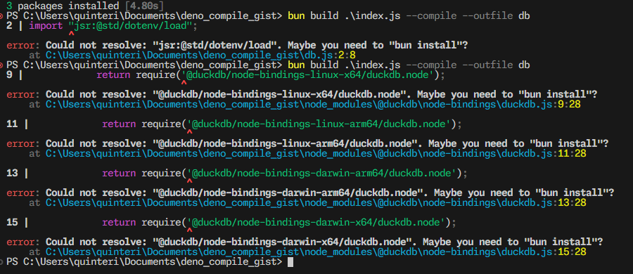

# Gist to show Deno compile error using @duckdb/node-api

This error occurs when trying to bundle an `.exe` file using `Bun` and `@duckdb/node-api`.

### Steps to reproduce error
1. Install bun
2. Run `bun install`
3. Run `bun build .\index.js --compile --outfile db`

### Error
